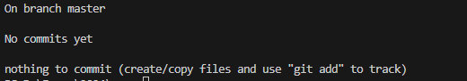

# __Создание локального репозитория__
Репозиторий в Git — это директория проекта, которая отслеживается Git. В директории хранятся файлы проекта, история изменения и служебная информация в скрытой поддиректории .git/. 

Git работает локально и удаленно. При локальной работе репозитории хранятся в директориях на жестком диске. При удаленной работе репозитории хранятся на сервисе. Наиболее популярным сервисом является GitHub. 

Создать локальный репозиторий можно следующими способами:
* инициализировать репозиторий для пустого каталога проекта;
* клонировать существующий удаленный репозиторий на компьютер.
 
## __Инициализация пустого репозитория__
Чтобы инициализировать пустой репозиторий:
1. Создайте на жестком диске каталог проекта, в котором будут храниться файлы проекта.
1. Перейдите в созданный каталог проекта:
    * в командной строке выполните команду `cd <путь_к_каталогу_проекта>`;
    * в VS Code выберите опцию File → Open Folder.
1. Инициализируйте репозиторий для проекта:
    * в командной строке выполните команду `git init`;
    * в VS Code перейдите в левой панели на кладку __Source Control__ и нажмите кнопку __Initialize Repository__.
1. В результате в указанном каталоге создается новый подкаталог __.git/__, в котором хранятся все необходимые файлы репозитория.
1. Можно проверить текущее состояние репозитория с помощью команды `git status`. Выводится состояние «nothing to commit» — репозиторий пустой. 
    
 

## __Создание локальной копии удаленного репозитория__
Чтобы создать локальную копию удаленного репозитория:
1. Создайте каталог проекта, в котором будет храниться локальная копия удаленного репозитория.
1. Скопируйте url удаленного репозитория. Для этого:
    * войдите в аккаунт на GitHub и откройте репозиторий;
    * нажмите зелёную кнопку __<> Code__;
    * в появившемся меню выберите вкладку __Local__ / __HTTPS__ и скопируйте url репозитория.
1. Откройте командную строку на MacOS или Git Bash для Windows. Также можно использовать терминал в редакторе кода __VS Code__. Для этого выберите команду __Terminal__ -> __New Terminal__.
1. Перейдите в папку каталога. Для этого в командной строке выполните команду `cd <путь_к_каталогу>`.
1. Склонируйте репозиторий. Для этого в командной строке выполните команду `git clone <url>`, где url — скопированный url репозитория.
1. В результате в указанном каталоге создается подкаталог с локальной копией удаленного репозитория.
 
